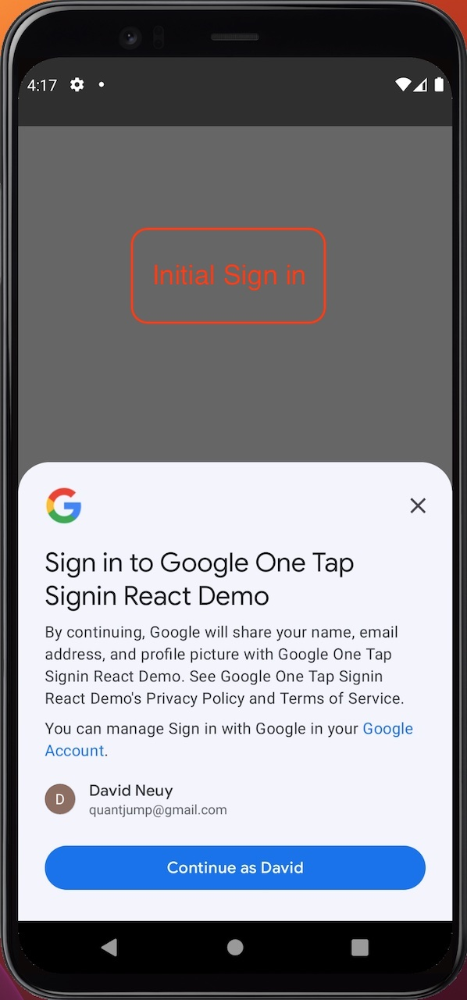
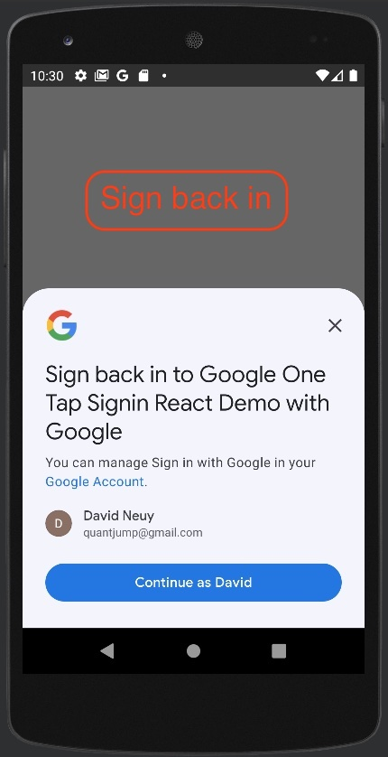
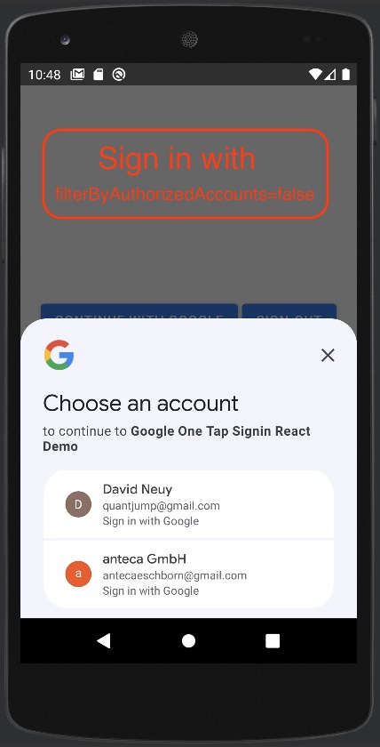

# Capacitor Native Google One Tap Signin plugin

Wraps the native android One Tap api for ionic capacitor apps. One Tap Sign In is part of Sign in with Google and offers features as automatic sign-in on return visits.

This library intends to provide the best google authentication experience for each platform.






After a successful authentication, the idToken is returned as base64 and as object.

The user is automatically signed-in, without a prompt after the first sign-in.

The andorid minSdkVersion is 24, however the one-tap library seems to require API version 29. For lower API versions GoogleSignIn is used.

# Install and Configure

#### 1. Install package

```sh
npm i --save capacitor-native-google-one-tap-signin
```

#### 2. Update capacitor dependencies

```sh
npx cap update
```

#### 3. Configure
You need to provide the plug-in a client ID of type "Web application". This client ID is used for the web and android platforms. The client ID is passed in the `initialize` call.

For the android platform, you need to create a client ID of type "Android" in the [Google Cloud Console](https://console.cloud.google.com/apis/dashboard), as stated in [One Tap Get started docu](https://developers.google.cn/identity/one-tap/android/get-started). You just need to create that client ID, you do not need to include it in any config.

For the ios platform, you need to create a client ID of type iOS in the [Google Cloud Console](https://console.cloud.google.com/apis/dashboard). Add the client ID to the  `{your-app}/ios/App/App/Info.plist` file with the key `GIDClientID` (see the demo app for reference). When creating the client ID, you will see the "iOS URL scheme" value in the Google Cloud Console. Add this also to the `Info.plist` file.

# Usage

```TypeScript
import { GoogleOneTapAuth, SignInResult } from 'capacitor-native-google-one-tap-signin';

await GoogleOneTapAuth.initialize({ clientId: clientId });
let signInResult = await GoogleOneTapAuth.tryAutoSignIn();
if (!signInResult.isSuccess) {
  signInResult = await GoogleOneTapAuth.renderSignInButton('appleid-signin', {}, { locale: 'en-us', theme: 'outline', text: 'continue_with', shape: 'rectangular' });
}
console.log(signInResult);

// See the demo folder for an example application.
```

# Notes about testing with an emulator

To test it using an emulator, you need to create an emulator with android play services and API version 24 or higher. See [my stackoverflow answer](https://stackoverflow.com/questions/71325279/missing-featurename-auth-api-credentials-begin-sign-in-version-6/75285717#75285717). For older API levels like 24, you may need to update Chrome after creating the emulator because the plugin targets JavaScript es2017.

# Supported platforms
Android, iOS, Web.

# Demos
See the `demo` folder.

# Detailed description of different use cases

See https://developers.google.com/identity/gsi/web/guides/features

# Exposed api
See `src/definitions.ts` for a complete definition.

```TypeScript
/**
 * For the web platform, starts pre-loading the google one tap JavaScript library.
 * @param options 
 */
initialize(options: InitializeOptions): Promise<void>;
/**
 * Tries to auto-sign in the user.
 * If there is a single google account and that account has previously signed into the app, then that user is auto signed in. A short popover is displayed during sign-in.
 * If there are multiple google accounts and more than one have previously signed into the app then a user selection screen is shown.
 * If there is no active google session or if no user session has logged in previously in the app or if the user has opt out of One Tap, the auto sign-in will fail.
 * See https://developers.google.com/identity/gsi/web/guides/features
 */
tryAutoSignIn(): Promise<SignInResult>;
/**
 * 
 * @param parentElementId 
 * @param options 
 * @param gsiButtonConfiguration Not all button configuration options are supported on android.
 */
renderSignInButton(parentElementId: string, options: RenderSignInButtonOptions, gsiButtonConfiguration?: google.GsiButtonConfiguration): Promise<SignInResult>;
/**
 * Ends the session.
 */
signOut(): Promise<SignOutResult>;
/**
 * Gets the last user defined or auto-created nonce.
 */
getNonce(): string;
```

# Design decisions
Promises will not be rejected for anticipated unsuccessful control flow. For example, if the one tap auto-login does not succeed with the reason `opt_out_or_no_session` then this is not exceptional but expected in many cases. Rejecting the promise would mean the caller would have to catch an exception when calling `await xy` and then run follow-up code in the catch block. Instead of rejecting promises the resolved promise contains a `isSuccess` property.

## Contributions
Welcome

## License

[MIT](./LICENSE)
