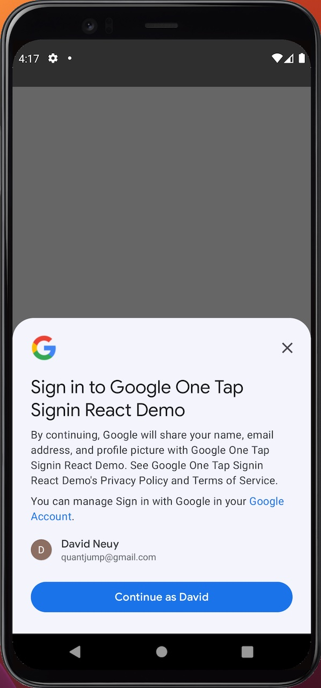

# Capacitor Native Google One Tap Signin plugin

Wraps the native android One Tap sign-in api for ionic capacitor apps.



Currently the idToken, id (e-mail), displayName, givenName, familyName, profilePictureUri are returned. You may check the idToken contents on https://jwt.io/.

The user is automatically signed-in, without a prompt after the first sign-in.

API version 29 or higher seems to be required for one-tap sign-in to work.


# Demos
See the `demo` folder.

# Setup
You need to provide the plug-in a client ID of type "Web application". However you will also need to create a client ID of type "Android" as stated in the [One Tap Get started docu](https://developers.google.cn/identity/one-tap/android/get-started).

To test it using an emulator, you need to create an emulator with android play services. See [my stackoverflow answer](https://stackoverflow.com/questions/71325279/missing-featurename-auth-api-credentials-begin-sign-in-version-6/75285717#75285717).

## Contributions

Welcome

## Install

#### 1. Install package

```sh
npm i --save capacitor-native-google-one-tap-signin
```

#### 2. Update capacitor deps

```sh
npx cap update
```

## Usage

### Android

todo

## License

[MIT](./LICENSE)
